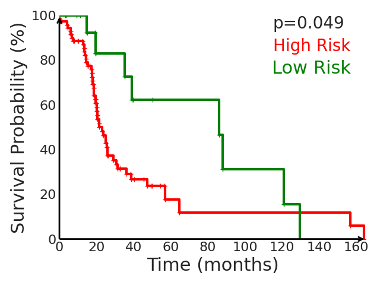

**This work is an implementation of the paper "Survival Modeling from Whole Slide Images via Patch-Level Graph Clustering and Mixture Density Experts"(https://arxiv.org/abs/2507.16476). It introduces a modular framework for predicting cancer-specific survival from whole slide pathology images (WSIs) that significantly improves upon the state-of-the-art accuracy. It integrates four key components. Firstly, to tackle large size of WSIs, dynamic patch selection via quantile-based thresholding is impelemented for isolating prognostically informative tissue regions. Secondly, graph-guided k-means clustering technique captures phenotype-level heterogeneity through spatial and morphological coherence. Thirdly, it has used attention mechanisms that model both intra- and inter-cluster relationships to contextualize local features within global spatial relations between various types of tissue compartments. Finally, an expert-guided mixture density modeling for estimating complex survival distributions using Gaussian mixture models is implemented. The proposed model achieves a concordance index of 0.712±0.028 and Brier score of 0.254±0.018 on TCGA-KIRC (renal cancer), and a concordance index of 0.645±0.017 and Brier score of 0.281±0.031 on TCGA-LUAD (lung adenocarcinoma). These results are significantly better than the state-of-art and demonstrate predictive potential of the proposed method across diverse cancer types.**

## 🔄 Pipeline Steps for creating the Virtual Environment

1. Create and activate environment

   conda create -n scgmde python=3.9 

   conda activate sgcmde


2. Install PyTorch (CUDA 11.3 build)
   ```
    pip install torch==1.12.1+cu113 torchvision==0.13.1+cu113 --extra-index-url https://download.pytorch.org/whl/cu113
   ```

3. Install RAPIDS cuDF/cuML
   ```
   pip install --extra-index-url=https://pypi.nvidia.com cudf-cu11==23.10.0 cuml-cu11==23.10.0
   ```

4. Install other Python dependencies
   ```
   pip install tqdm lifelines munch tensorboardX einops h5py seaborn
   ```
   
## 📂 Data Preparation

1. TCGA data
Download diagnostic WSIs and corresponding clinical metadata from TCGA(https://portal.gdc.cancer.gov/).

2. Patch extraction
Use the CLAM WSI processing tool(https://github.com/mahmoodlab/CLAM) to crop WSIs into 256×256 patches at 20× magnification.

3. Feature extraction
Extract patch-level features with a ViT(https://github.com/lunit-io/benchmark-ssl-pathology#pre-trained-weights) model pretrained on large-scale WSI collections using self-supervised learning.

4. Annoation files and folder structure
Prepare the annotaion file as in SCMIL(https://github.com/yang-ze-kang/SCMIL). Prepare you own 'wsi_annos_vit-s-dino-p16.txt' file.

## 📂 Dataset Structure

```
data/
├── kirc/
│   ├── 5fold_wsi-rnaseq/
│   │   ├── fold1/
│   │   │   ├── train.txt
│   │   │   └── val.txt
│   │   ├── fold2/
│   │   ├── fold3/
│   │   ├── fold4/
│   │   └── fold5/
│   ├── clinical.csv
│   └── wsi_annos_vit-s-dino-p16.txt
└── luad/
    ├── 5fold_wsi-rnaseq/
    │   ├── fold1/
    │   │   ├── train.txt
    │   │   └── val.txt
    │   ├── fold2/
    │   ├── fold3/
    │   ├── fold4/
    │   └── fold5/
    ├── clinical.csv
    └── wsi_annos_vit-s-dino-p16.txt
```
    
## 🧪  Train the model
python train.py --config configs/luad_sgcmde.py

## 🌡️ Final Plot
python plot.py --config configs/luad_sgcmde.py
<p align="center">
  
</p>

## 📚 Acknowledgements
Thanks Zekang Yang, Hong Liu, and Xiangdong Wang for the public access of the codebase https://github.com/yang-ze-kang/SCMIL
